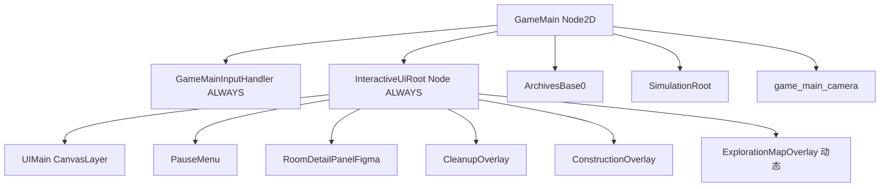

# GameMain：InteractiveUiRoot 场景结构重构

## 目标（玩法语义 → 场景树）

- **冻结**：世界模拟（`ArchivesBase0`、`SimulationRoot`、相机所在逻辑链等）在 `tree.paused` 下保持不动。
- **不冻结交互**：所有「HUD + 玩家打开的决策/模态 UI」应在**同一棵** `PROCESS_MODE_ALWAYS` 子树下，**新功能默认加在这棵树下**，避免再出现「兄弟节点有的 ALWAYS、有的继承 GameMain」的偶然结构。

## 目标树形（示意）

说明：`CanvasLayer.layer` 相对视口全局有效，**改父节点不改变 layer 数值**；需仍满足 [10-exploration-region-map.md](docs/design/2-gameplay/10-exploration-region-map.md) 中与 UIMain 的上下层关系时，保持各层 `layer` 不变即可。

## 实现步骤

1. **新增节点**：`InteractiveUiRoot`，`extends Node`，脚本仅 `process_mode = PROCESS_MODE_ALWAYS`（可加一句类级注释说明职责）。
2. **编辑器内 reparent**（或改 `game_main.tscn`）：将下列节点从 `GameMain` 直接子节点改为 `InteractiveUiRoot` 子节点（顺序建议与现有一致以减少 diff 噪声）：
   - `UIMain`
   - `PauseMenu`
   - `RoomDetailPanel`
   - `RoomDetailPanelFigma`
   - `CleanupOverlay`
   - `ConstructionOverlay`
3. **动态实例化**：[game_main_exploration_ui.gd](scripts/game/game_main_exploration_ui.gd) 中 `add_child` 的父节点由 `game_main` 改为 `game_main.get_node("InteractiveUiRoot")`（或缓存引用）。
4. **路径更新**：全局搜索 `get_node_or_null("UIMain"`、`"PauseMenu"`、`"RoomDetailPanel` 等以 `GameMain` 为根的路径；改为 `InteractiveUiRoot/UIMain` 或改用 **唯一节点名 `%InteractiveUiRoot` / `%UIMain`**（Godot 4）减少硬编码。
5. **特殊依赖**：[pause_menu.gd](scripts/ui/pause_menu.gd) 中 `get_parent()` 若为 `GameMain` 用于 `collect_game_state`，reparent 后父变为 `InteractiveUiRoot`，需改为 `get_parent().get_parent()` 或 `owner` / 显式 `NodePath` 指向 `GameMain`。
6. **可选清理**：根上已保证 ALWAYS 后，子 `CanvasLayer` 内重复的 `process_mode = ALWAYS` 可按团队偏好保留（文档写明双保险）或经测试后删除。

## 风险与缓解

| 风险 | 缓解 |
|------|------|
| 字符串路径漏改导致 null | `explore` 子代理全仓库搜 `UIMain`/`PauseMenu`/`RoomDetail`/`CleanupOverlay`/`ConstructionOverlay`；编译前 Godot 加载场景看报错 |
| pause_menu 父节点假设 | 单测或手工：打开暂停菜单存读档 |
| 测试 driver 硬编码路径 | 同步改 [test_driver](scripts/test/test_driver.gd) 与相关 flow JSON |

## 验收

- 时间暂停：顶栏、房间详情、探索图、清理/建设确认均可交互（与方案 A 行为一致或更好）。
- ESC 暂停菜单仍阻断 `GameMainInputHelper` 中游戏输入。
- 相关 GameplayFlow 全绿。

## 子代理使用方案

- **子代理类型**：`explore`（全仓库路径与 `get_parent` 假设）；`shell`（跑 GameplayFlow / 导出脚本）。
- **任务分工**：explore 输出「须改文件清单 + 行号」；主代理改 `game_main.tscn` 与核心脚本；shell 跑回归。
- **并行策略**：explore 清单 → 串行改场景与代码 → shell 回归；不得并行改同一路径文件。
- **触发条件**：开始重构前跑一次 explore；合并前再跑一次。
- **交付物**：变更文件列表、`pause_menu` 等父节点修正说明、GameplayFlow 结果摘要。
