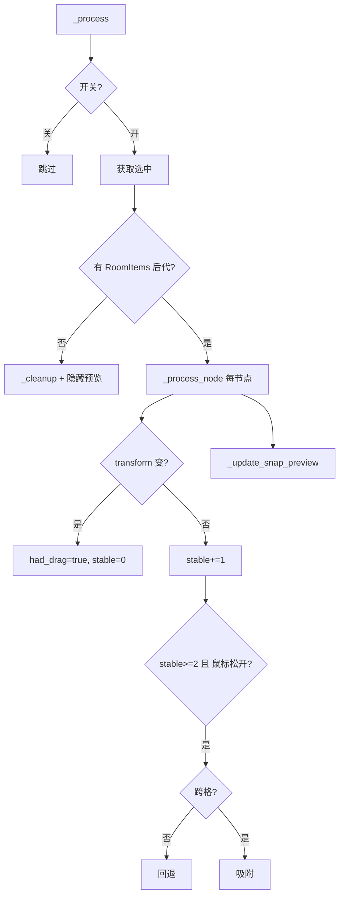

# 05 - RoomItems 网格对齐

## 概述

在拥有 `RoomReferenceGrid` 的 preset_room_frame 场景中，当在编辑器中移动 `RoomItems` 下的节点（含深层子节点）时，可自动对齐到 0.5m 网格；提供编辑器开关以启用/关闭该功能。

**实现文件**：`addons/room_items_grid_snap/room_items_grid_snap_plugin.gd`

---

## 1. 功能目标

| 项目 | 说明 |
|------|------|
| 适用场景 | preset_room_frame 及包含 RoomReferenceGrid 的场景 |
| 作用对象 | RoomItems 下的所有 Node3D 子节点（含 items、lights、doors 及其子节点） |
| 对齐基准 | RoomReferenceGrid 的 0.5m 网格 |
| 用户控制 | 编辑器内开关，可随时启用/关闭 |

---

## 2. 程序实现重点

> 以下标注与 `room_items_grid_snap_plugin.gd` 中的实现一一对应，便于维护与排查。

### 2.1 常量与状态变量

| 常量/变量 | 值/类型 | 实现要点 |
|-----------|---------|----------|
| `GRID_CELL_SIZE` | 0.5 | 与 `RoomReferenceGrid`、`ActorBox` 一致，不可单独修改 |
| `GRID_FLOOR_Y` | 0.6 | preset_room_frame 底面 y 坐标，Y 轴吸附基准 |
| `STABLE_FRAMES_REQUIRED` | 2 | 连续 2 帧 transform 不变才视为拖拽结束，防误触 |
| `_last_transforms` | Dict | `instance_id → Transform3D`，用于检测位移变化 |
| `_had_drag` | Dict | 标记该节点是否发生过拖动，与 `_is_mouse_release_valid()` 共同决定是否执行吸附 |
| `_drag_start_positions` | Dict | 拖拽起始 `global_position`，用于回退与预览 |

### 2.2 拖拽结束判定（三重条件）

执行吸附或回退前，**必须同时满足**：

1. **transform 稳定**：`_stable_frames[nid] >= STABLE_FRAMES_REQUIRED`（连续 2 帧无变化）
2. **发生过拖动**：`_had_drag.get(nid, false) == true`
3. **鼠标已松开**：`_is_mouse_release_valid()` → `not Input.is_mouse_button_pressed(MOUSE_BUTTON_LEFT)`

> 实现位置：`_process_node()` 约 319–320 行。缺一不可，否则会出现拖动中误吸附或松开后无响应。

### 2.3 防抖动：按网格单位判断

- 使用 `_world_to_grid_cell()` 将世界坐标转为 `Vector3i` 格坐标
- 比较 `start_cell == current_cell` 判断参考点是否跨格
- **格未变化**：回退到 `_drag_start_positions[nid]`，不吸附
- **格已变化**：执行 `_snap_position_for_node()` 吸附

> 实现位置：`_process_node()` 约 326–331 行。避免浮点误差导致「轻微拖动」被误判为跨格。

### 2.4 参考点与吸附规则

| 函数 | 实现要点 |
|------|----------|
| `_get_reference_point()` | 有 ActorBox：取 min 角 `pivot + (-hx, 0, -hz)`；无则用 pivot |
| `_snap_position_for_node()` | 将参考点吸附到网格后，反算 pivot：`snapped_corner + (hx, 0, hz)` |
| `_snap_center()` | 无 ActorBox 时退化为中心点吸附 |

> BoxMesh 以中心为原点，预览盒体需 `position = pivot + (0, hy, 0)` 才能与 actor_box 视觉对齐。

### 2.5 预览盒体

| 预览 | 常量 | 显示条件 | 实现要点 |
|------|------|----------|----------|
| 原位置（灰） | `PREVIEW_COLOR_ORIGIN` | `_had_drag` 为 true | `_ensure_origin_preview_mesh()`，位置 = `start_pos + (0, hy, 0)` |
| 目标位置（绿） | `PREVIEW_COLOR_SNAP` | `start_cell != current_cell` | `_ensure_preview_mesh()`，位置 = `snapped_pos + (0, hy, 0)` |

- 预览挂到 `edited_scene_root`，`owner = null` 不写入场景
- 插件退出时 `_dispose_preview_meshes()` 调用 `queue_free()` 释放，避免残留

### 2.6 生命周期与清理

| 时机 | 动作 |
|------|------|
| `_enter_tree` | 注册设置、菜单、`set_process(true)` |
| `_exit_tree` | `_hide_*`、`_dispose_preview_meshes()`、移除菜单、`set_process(false)` |
| `selected.is_empty()` | `_cleanup_tracking()` 清空所有缓存，`_update_snap_preview([])` 隐藏预览 |

---

## 3. 技术方案（设计层面）

### 3.1 核心思路

通过 EditorPlugin 的 `_process` 每帧检测拖拽结束：transform 连续 2 帧不变 + 鼠标松开 → 执行吸附或回退，并用 `EditorUndoRedoManager` 支持撤销。

### 3.2 网格对齐规则

- **有 ActorBox**：actor_box 的 min 角吸附到网格线交点
- **无 ActorBox**：pivot 中心点吸附
- 仅修改 `global_position`，旋转、缩放保持不变

### 3.3 数据流示意



---

## 4. 实现结构

```
addons/room_items_grid_snap/
├── plugin.cfg
└── room_items_grid_snap_plugin.gd
```

### 4.1 函数索引

| 函数 | 职责 |
|------|------|
| `_process` | 主循环：获取选中、处理节点、更新预览 |
| `_process_node` | 单节点：检测拖拽结束，执行吸附/回退 |
| `_update_snap_preview` | 根据 `_had_drag`、`would_snap` 显示/隐藏灰绿预览 |
| `_ensure_preview_mesh` / `_ensure_origin_preview_mesh` | 创建或复用 MeshInstance3D，设置材质 |
| `_set_preview_box_size` | 统一更新 BoxMesh 尺寸 |
| `_get_room_items_selected_nodes` | 过滤出 RoomItems 后代且场景含 RoomReferenceGrid 的 Node3D |
| `_find_room_items_ancestor` | 向上查找名为 RoomItems 的祖先 |
| `_has_room_reference_grid` | 检查 RoomItems 父节点是否有兄弟 RoomReferenceGrid |
| `_world_to_grid_cell` | 世界坐标 → 格坐标 Vector3i |
| `_get_reference_point` | 参考点（min 角或 pivot） |
| `_snap_position_for_node` | 吸附后的 pivot 坐标 |
| `_revert_to_position` / `_apply_snap` | UndoRedo 回退/吸附 |
| `_dispose_preview_meshes` | 插件退出时 queue_free 预览节点 |

---

## 5. 使用方式

1. **项目 → 项目设置 → 插件**，启用「RoomItems Grid Snap」
2. 打开 preset_room_frame，选中 RoomItems 下的 Node3D 子节点
3. 在 3D 视口拖动节点，松开后自动对齐
4. **编辑器 → RoomItems 网格对齐** 可随时开关

---

## 6. 注意事项

- 仅当场景含 `RoomReferenceGrid` 且选中节点在 `RoomItems` 下时生效
- 对齐仅改 `global_position`，旋转、缩放不变
- 通过 UndoRedo 支持 Ctrl+Z
- Godot 4.6 EditorPlugin API 若有变动需对照调整

---

## 7. 相关文档

- [03 - 3D 场景编辑器](03-3d-scene-editor.md)
- [04 - 预设 3D 房间框架](04-preset-room-frame.md)
