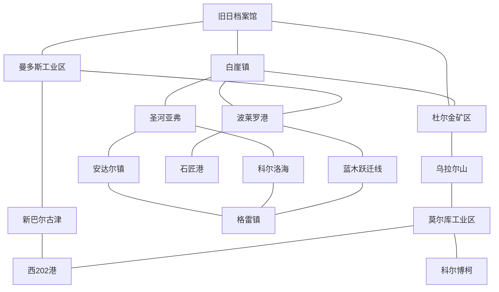

# 10 - 探索系统：区域地图

## 核心机制

**探索一个地区 → 解锁它连接的若干地区**。没有"返回"限制，解锁即永久可见。

**所有连接均为双向**：若 A 与 B 相连，则探索 A 可解锁 B，探索 B 亦可解锁 A。

起点：**旧日档案馆**（游戏开始时已解锁且已探索）。

---

## 探索模式入口与流程

### 解锁条件

建立**事务所** + 获得**调查员**后，主界面出现**探索按钮**。

### 进入探索模式

点击探索按钮 → 打开独立的 2D 场景（探索地图界面）。

### 首次进入

旧日档案馆视为已探索状态，自动解锁与其相连的三个地区：**白崖镇、杜尔金矿区、曼多斯工业区**。这三个地区处于「已解锁 / 未探索」状态。

### 区域状态

| 状态 | 含义 | 可视表现（待定） |
|------|------|----------------|
| 未发现 | 玩家尚不知道该地区存在 | 不可见 |
| 已解锁 / 未探索 | 可看到地区，但尚未探索 | 可见、可点击 |
| 探索中 | 已派出调查员，正在探索 | 进度指示 |
| 已探索 | 探索完成 | 完全可见，显示调查点 |

### 交互流程

```
点击已解锁地区
  └─ 打开【地区信息面板】
       ├─ 探索所需时间
       ├─ 占用调查员数量
       └─ 可能获得的资源
       └─ 【探索】按钮
            └─ 点击 → 扣除资源、占用调查员 → 开始计时
                       └─ 到达时间后：
                            ├─ 释放调查员
                            ├─ 解锁该地区相连的所有未发现地区
                            └─ 显示该地区的调查点（最多 3 个）

点击调查点（仍在地区信息 UI 内）
  └─ 展开【调查点事件界面】
       ├─ 图片
       ├─ 名称
       ├─ 文本描述
       └─ 选项（1~3个）+ 固定选项【稍后处理】

选择事件选项
  ├─ 若选【稍后处理】→ 关闭事件界面，不发生任何变化
  ├─ 若选普通选项（无后续）→ 立即结算消耗/收益
  │                          ├─ 普通收尾：调查点进入已完成状态
  │                          └─ 节点转化：调查点转为探索地图节点（持续生效）
  └─ 若选普通选项（有后续）→ 立即结算消耗/收益 → 进入进展计时
                              └─ 到时后调查点更新为后续事件
```

### 并行规则

- 地区探索可并行进行（多个地区可同时处于探索中）
- 调查点“有后续”进展可并行进行（多个调查点可同时计时推进）

### 结算周期与显示口径

- 持续产出 / 持续消耗按**每小时**结算
- UI 通常按**每天**口径展示（玩家默认看到日数据）
- 数值设计约定：相关数值尽量可被 24 整除，减少展示换算误差

### 调查点

- 每个地区探索完成后，会显示该地区存在的**调查点**
- 一个地区**最多 3 个**调查点
- 调查点显示在**地区信息 UI**中，不单独跳转场景
- 调查点在当前设计中为**一次性内容**：完成后不会自动刷新新调查点
- 调查点在当前设计中**不可重复触发**

### 调查点事件结构

每个调查点本质是一个事件，包含：

- 一张图片
- 一个名称
- 一段文本
- 1~3 个可选项
- 一个固定额外选项：**稍后处理**（仅返回，不触发任何逻辑）

### 选项交互规则

- 选项显示：每个选项有自己的文字
- 悬停提示：显示该选项的**消耗**与**收益**
- 选择后立即结算：扣除资源 + 发放收益（按该选项配置）
- 互斥原则：一旦选择某个选项，其他选项立即移除（表示已做出决定）
- “稍后处理”无冷却、无优先级变化，通常固定放在选项列表最下方

### 有后续 / 无后续

**有后续选项**

- 选择后进入该选项的“进展时间”计时
- 计时结束后，调查点刷新为新的后续调查点（新事件）

**无后续选项**

- 选择后调查点进入“已完成状态”
- 已完成状态通常保留原名称
- 已完成状态会更换介绍文字
- 已完成状态可选地更换展示图片
- 已完成状态只保留一个选项：**明白了**

### 调查点转化为“节点”

部分调查点在完成特定选项后，不进入普通已完成态，而是转化为探索地图上的**节点**（类似档案馆中的房间功能点）。

### 节点规则

- 节点由调查点事件的某个选项触发生成
- 生成时立即结算该选项的一次性消耗/收益
- 节点会持续占用该选项要求的调查员数量
- 节点可配置资源产出（可为多种资源）
- 资源产出类型与产出效率由节点配置决定

### 节点运行与停机

- 当节点持续消耗所需资源不足时，节点进入**停机**状态
- 停机后：不再消耗资源、不再产出资源
- 停机后：占用的调查员**不会自动返还**（仍处于占用）
- 出现停机时，主界面 UI 与探索界面 UI 都会给出提醒
- 节点可手动**关闭**
- 关闭后：不再消耗、不再产出、并释放该节点占用的调查员

### 基地类节点（前线基地 / 基站 / 临时基地）

部分调查点可建设为“基地类节点”，常见命名包括前线基地、基站、临时基地等。

- 这类调查点的选项通常代表不同的建设方案
- 不同方案拥有不同的建设消耗
- 不同方案可导向不同的基地结果（基地名称不同、收益不同）
- 基地建成后，节点通常进入长期运行状态

### 基地类节点的长期运行

- 持续占用调查员（人数由所选建设方案决定）
- 持续消耗资源（具体资源种类与速率由基地配置决定）
- 持续产出资源（可为单资源或多资源）
- 基地产出继续归入 UI 口径：**由探索节点产出的**
- 基地持续消耗继续归入 UI 口径：**固有消耗**

### 节点消耗类型

- **一次性消耗**：在选择该选项时立刻扣除
- **持续性消耗**：节点生效期间持续扣除
- 探索地图节点的持续性消耗，在档案馆 UI 中统一并入**固有消耗**

### 节点与UI口径统一

- 这些节点产出的资源，归类为此前 UI 设计中的**“由探索节点产出的”**
- 该分类用于档案馆资源面板的来源展示与统计口径

### 存档与读档

- 探索进度与调查点进展需要写入存档并在读档时恢复
- 离线时间按全局规则做**自动补算**（探索、调查点后续进展、节点运行状态统一按离线时长推进）

---

## 区域清单（共 16 个）

| # | 区域 ID | 名称 | 连接数 | 备注 |
|---|---------|------|--------|------|
| 1 | old_archives | 旧日档案馆 | 3 | 起点 |
| 2 | white_cliff | 白崖镇 | 4 | 交通枢纽 |
| 3 | durkin_mine | 杜尔金矿区 | 3 | |
| 4 | mandos_industrial | 曼多斯工业区 | 3 | |
| 5 | bolero_port | 波莱罗港 | 4 | 交通枢纽 |
| 6 | saint_river_afv | 圣河亚弗 | 3 | |
| 7 | andal_town | 安达尔镇 | 2 | |
| 8 | korloh_sea | 科尔洛海 | 2 | |
| 9 | bluewood_transit | 蓝木跃迁线 | 2 | |
| 10 | grey_town | 格雷镇 | 3 | |
| 11 | ural_mountain | 乌拉尔山 | 2 | |
| 12 | new_barguzin | 新巴尔古津 | 2 | |
| 13 | morku_industrial | 莫尔库工业区 | 3 | |
| 14 | mason_port | 石匠港 | 1 | 末端 |
| 15 | west_202_port | 西202港 | 2 | |
| 16 | korborko | 科尔博柯 | 1 | 末端 |

---

## 连接关系（双向邻接表）

> 含义：探索该区域后，解锁列表中所有尚未解锁的区域。反之亦然。

| 区域 | 相连区域 |
|------|---------|
| 旧日档案馆 | 白崖镇、杜尔金矿区、曼多斯工业区 |
| 白崖镇 | 旧日档案馆、杜尔金矿区、圣河亚弗、波莱罗港 |
| 杜尔金矿区 | 旧日档案馆、白崖镇、乌拉尔山 |
| 曼多斯工业区 | 旧日档案馆、新巴尔古津、波莱罗港 |
| 波莱罗港 | 白崖镇、曼多斯工业区、蓝木跃迁线、石匠港 |
| 圣河亚弗 | 白崖镇、安达尔镇、科尔洛海 |
| 安达尔镇 | 圣河亚弗、格雷镇 |
| 科尔洛海 | 圣河亚弗、格雷镇 |
| 蓝木跃迁线 | 波莱罗港、格雷镇 |
| 格雷镇 | 安达尔镇、科尔洛海、蓝木跃迁线 |
| 乌拉尔山 | 杜尔金矿区、莫尔库工业区 |
| 新巴尔古津 | 曼多斯工业区、西202港 |
| 莫尔库工业区 | 乌拉尔山、西202港、科尔博柯 |
| 西202港 | 新巴尔古津、莫尔库工业区 |
| 石匠港 | 波莱罗港 |
| 科尔博柯 | 莫尔库工业区 |

**共 20 条边，16 个节点。**

### 末端节点（度 = 1）

- **石匠港** — 仅连接波莱罗港
- **科尔博柯** — 仅连接莫尔库工业区

---

## 可视化（Mermaid）



---

## 当前实现状态（工程对齐）

以下描述**仓库内已有代码与数据**，与上文策划稿并列；未单独标注「已实现」的段落仍以设计目标为准。

| 维度 | 设计稿 | 当前工程 |
|------|--------|----------|
| 承载 | 独立 2D 探索场景 | `CanvasLayer` 叠加在 `game_main` 上（`ExplorationMapOverlay`） |
| 入口条件 | 建事务所 + 有调查员后出现探索按钮 | **未**接线：由 GameMain 底栏占位 `BOTTOM_PLACEHOLDER_EXPLORATION_MAP` 与 `UIMain` 的 `btn_center` 打开 overlay（便于开发与烟测） |
| 邻接与耗时 | 文案与图 | `datas/exploration_config.json` 的 `region_edges`、`default_explore_game_hours`、`explore_investigators_per_region`；地区元数据当前为 `regions_placeholder` |
| 时间推进 | 文档多处写「离线时长自动补算」 | **探索进度**仅在游戏运行、`GameTime` 流逝且探索地图打开时由 `ExplorationTick` 扣减；**无**现实时间离线补算；读档为 `exploration` 快照 |
| UI | 地区信息 + 调查点链 | 已实现：地区按钮、`ExplorationRegionInfoPanel`（简介 +「开始探索」）、**已探索地区**的调查点列表 + `ExplorationInvestigationEventPanel`（四行正文、选项悬停、`UIMain` 资源扣发）。**未**实现：有后续链、节点转化、正式调查员建筑条件接线 |
| 存档 | 随主存档 | 根键 `exploration`，`ExplorationStateCodec.SAVE_VERSION == 3`，含 `completed_investigation_site_ids`；**v2** 读档迁移为 v3（调查点完成列表补空）；v1 档读入后探索中状态清空；详见 [03 - 存档系统](03-save-system.md) |

**脚本与场景（速查）**：`scripts/game/exploration/exploration_service.gd`、`exploration_tick.gd`、`exploration_rules.gd`、`exploration_state_codec.gd`；`scripts/ui/exploration_map_overlay.gd`、`exploration_region_info_panel.gd`、`exploration_investigation_event_panel.*`；静态数据 `datas/exploration_investigations.json`；输入与叠层命中见 `scripts/game/game_main_input.gd`。

**自动化**：GameplayFlow 侧已与其他系统一并收敛为全局「基础测试 + 基础数据」回归（见 `docs/testing/README.md`、`tools/game-test-runner/scripts/run_gameplay_regression.ps1`）。探索相关断言可继续通过 `scripts/test/test_driver.gd` 的 `exploreRegion`、`advanceGameHours`、`verifySaveSlotExploration`、`loadGameMainFromSlot` 等在自定义 flow 中编排。

---

## 可达性分析（从旧日档案馆出发）

从旧日档案馆出发，按广度优先展开（每轮探索当轮所有已解锁但未探索的区域）：

| 探索轮次 | 可新解锁的区域 |
|---------|--------------|
| 起始 | 旧日档案馆（已解锁） |
| 第 1 轮（探索旧日档案馆） | 白崖镇、杜尔金矿区、曼多斯工业区 |
| 第 2 轮（探索上述 3 个） | 圣河亚弗、波莱罗港、乌拉尔山、新巴尔古津 |
| 第 3 轮 | 安达尔镇、科尔洛海、蓝木跃迁线、石匠港、莫尔库工业区、西202港 |
| 第 4 轮 | 格雷镇、科尔博柯 |

**结论：全部 16 个区域均可达。最深需 4 轮探索。**

---

## 变更记录

| 日期 | 变更 |
|------|------|
| 2026-03-27 | 初版：16 区域、20 条双向边 |
| 2026-03-27 | 确认科尔洛海连接圣河亚弗和格雷镇 |
| 2026-03-27 | 确认西202港连接新巴尔古津和莫尔库工业区 |
| 2026-03-27 | 确认格雷镇连接科尔洛海、安达尔镇、蓝木跃迁线 |
| 2026-03-27 | 确认所有连接均为双向，重构为无向图 |
| 2026-03-27 | 新增：探索模式入口、区域状态、交互流程、调查点 |
| 2026-03-27 | 新增：调查点事件UI、选项悬停收益消耗、有后续进展与完成态 |
| 2026-03-27 | 新增：调查点可转探索节点，含调查员占用、持续消耗与持续产出 |
| 2026-03-27 | 新增：基地类节点（前线基地/基站/临时基地）与方案差异化收益 |
| 2026-03-27 | 新增：并行探索/并行后续进展、资源不足停机、节点手动关闭规则 |
| 2026-03-27 | 新增：每小时结算+按天展示、调查点一次性、稍后处理仅返回、存档读档说明 |
| 2026-03-27 | 确认：所有进度相关系统均按离线时长自动补算 |
| 2026-03-29 | 增补「当前实现状态」：overlay 承载、配置驱动的邻接/tick、存档 v2、与设计稿差异（无离线补算、无调查点链）；测试与 flow 索引 |
