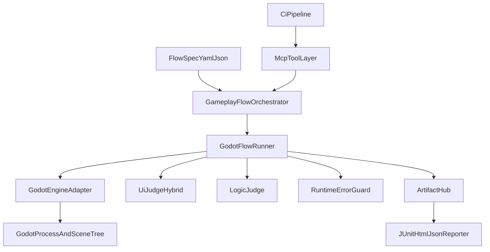
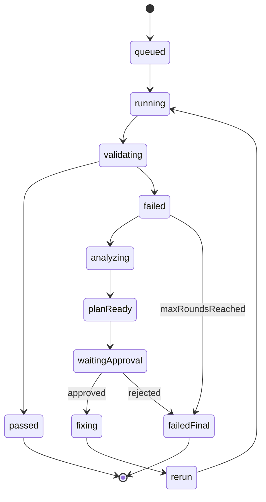

# 11 - Godot + MCP GameplayFlow 架构与契约（v2 设计稿）

## 1. 目标与边界

目标：建立一套可用于 Agent 与人工统一调用的自动化验收框架，支持“执行 -> 验收 -> 归因 -> 修复 -> 复验”的闭环。

边界：
- 本文档是 v2 设计稿，兼容已有 [04-game-test-runner-contract-v1](docs/design/99-tools/04-game-test-runner-contract-v1.md)。
- 不覆盖多项目云调度；先聚焦本项目本地与 CI 场景。

---

## 2. 总体架构



组件职责：
- `GameplayFlowOrchestrator`：运行编排、重试策略、审批闸门、自修复轮次控制。
- `GodotFlowRunner`：解释执行 step，维护运行状态机。
- `GodotEngineAdapter`：输入注入、节点查询、截图、日志抓取、状态快照。
- `UiJudgeHybrid`：硬规则与语义规则并行判定。
- `RuntimeErrorGuard`：识别 Godot 启动/运行错误并执行可恢复策略。
- `ArtifactHub`：统一产物落盘与索引。

---

## 3. GameplayFlow DSL MVP（Todo: define-godot-dsl-mvp）

## 3.1 文件结构

```yaml
flowId: ui_room_detail_sync_acceptance
name: 房间详情UI同步验收
system: ui
profile: strict_ui
tags: [ui, figma, strict]
env:
  SAVE_SLOT: "0"
  LOCALE: "zh_CN"
steps:
  - id: launch_game
    action: launchGame
  - id: new_game
    action: click
    target: { text: "新游戏" }
  - id: overwrite_slot
    action: click
    target: { testId: "save_slot_0_overwrite" }
  - id: wait_ingame
    action: wait
    until: { scene: "game_main" }
    timeoutMs: 20000
  - id: open_room_detail
    action: click
    target: { testId: "room_node_001" }
  - id: check_room_detail_visual
    action: check
    kind: visual_hard
    ruleSet: room_detail_strict_v1
```

## 3.2 关键语义

- `flowId`：全局唯一，报告主键之一。
- `profile`：`smoke` / `strict_ui` / `regression`。
- `action`：`launchGame`、`click`、`dragCamera`、`wait`、`check`、`runSubflow`、`snapshot`。
- `target`：支持 `testId`、`nodePath`、`text`、`relation`（例如 `below`）。
- `check.kind`：
  - `visual_hard`（尺寸/间距/对齐/字体/显隐）
  - `visual_semantic`（设计语义一致性）
  - `logic_state`（状态机、资源、权限）
  - `runtime_log`（错误日志）

## 3.3 子流与参数注入

```yaml
- id: prepare_new_game
  action: runSubflow
  file: common/new_game_enter_world.yaml
  env:
    SAVE_SLOT: "${SAVE_SLOT}"
```

约束：
- 子流只能覆盖 `env`，不允许覆盖父 flow 的 `profile`。
- 子流失败默认冒泡；可通过 `optional: true` 局部容忍。

---

## 4. MCP 契约（Todo: design-mcp-contract）

在 v1 工具基础上扩展，保留兼容：

- `list_test_scenarios`
- `run_game_test`
- `get_test_artifacts`
- `get_test_report`

新增：
- `get_test_run_status`：轮询运行状态与当前 step。
- `cancel_test_run`：取消长任务。
- `approve_fix_plan`：用户审批修复计划后继续执行。
- `resume_fix_loop`：从审批点恢复自动闭环。

## 4.1 `run_game_test` v2 请求草案

```json
{
  "system": "ui",
  "scenario": "ui_room_detail_sync_acceptance",
  "profile": "strict_ui",
  "environment": {
    "mode": "local",
    "locale": "zh_CN",
    "resolution": "1920x1080"
  },
  "execution": {
    "timeoutSec": 900,
    "retry": 1,
    "boundedAutoFixMaxRounds": 3,
    "autoHealRuntimeError": true
  },
  "assertions": {
    "visualHard": true,
    "visualSemantic": true,
    "logic": true,
    "runtimeLogs": true
  },
  "artifacts": {
    "level": "all"
  }
}
```

## 4.2 统一响应骨架

```json
{
  "ok": true,
  "run_id": "2026-03-27_ui_room_detail_sync_acceptance_001",
  "status": "running",
  "current_step_id": "open_room_detail",
  "fix_loop_round": 1,
  "approval_required": false
}
```

错误响应沿用 v1：

```json
{
  "ok": false,
  "error": {
    "code": "INVALID_ARGUMENT",
    "message": "scenario not found"
  }
}
```

---

## 5. 运行状态机与修复闭环



状态定义：
- `queued/running/validating`：执行主流程。
- `failed/analyzing/planReady`：失败归因与修复方案阶段。
- `waitingApproval`：等待用户确认。
- `fixing/rerun`：修复并复验。
- `failedFinal/passed`：终态。

---

## 6. 稳定性策略（Todo: stability-strategy）

## 6.1 等待策略分层
- **L1 断言轮询**：默认策略，`check` 内部轮询直到超时。
- **L2 长等待**：`wait.until`，用于清理/建设等长耗时流程。
- **L3 稳定等待**：`wait.stable`，用于动画/过渡收敛。
- **L4 采样等待**：`wait.sleep` 仅用于中段证据采样（如 `Tmid` 2 秒）。

## 6.2 重试策略
- `stepRetry`：仅对幂等步骤开启（如 `wait/check/snapshot`）。
- `runRetry`：整轮重跑上限 1 次。
- `autoFixRounds`：默认最多 3 轮（`bounded_auto_fix`）。

## 6.3 失败分类
- `VISUAL_LAYOUT_MISMATCH`
- `VISUAL_SEMANTIC_MISMATCH`
- `LOGIC_STATE_TRANSITION_ERROR`
- `LOGIC_RESOURCE_IDEMPOTENCY_ERROR`
- `RUNTIME_EXCEPTION`
- `TIMEOUT`
- `INFRA_ERROR`
- `SELF_HEAL_EXHAUSTED`

## 6.4 运行时自愈（与项目日志能力对齐）
- 优先读取 `godot.log` 和关键错误摘要。
- 可恢复错误（例如资源未就绪、场景加载延迟）执行有限重试。
- 不可恢复错误（脚本异常持续、关键节点缺失）直接进入 `analyzing` 并提示阻断。

---

## 7. 两个闭环场景的标准化 Flow 规格

## 7.1 场景A：Figma 同步 UI 严格验收

- `flowId`：`ui_room_detail_sync_acceptance`
- 关键步骤：
  - 新游戏并覆盖 `slot=0`
  - 拖动镜头，等待 2 秒
  - 点击房间，唤出详情 UI
  - 执行 `visual_hard` + `visual_semantic` 双轨校验
- 关键产物：
  - `room_detail_open.png`
  - `room_detail_diff_hard.json`
  - `room_detail_diff_semantic.md`

## 7.2 场景B：等待驱动联动验收（清理/建设）

- `flowId`：`build_clean_wait_linked_acceptance`
- 三阶段断言：
  - `T0`：进入进行中状态
  - `Tmid`：等待 2 秒，验证进度递增/倒计时递减
  - `Tdone`：完成态 UI 与逻辑解锁一致
- 关键产物：
  - `clean_t0.png` / `clean_tmid.png` / `clean_tdone.png`
  - `build_t0.png` / `build_tmid.png` / `build_tdone.png`
  - `state_snapshot_t0_tmid_tdone.json`

---

## 8. 与现有 v1 契约的兼容策略

- 兼容现有 `run_game_test` 入口，新增字段采用可选参数。
- 若调用方未传 `boundedAutoFixMaxRounds`，默认 `0`（关闭自动修复循环）。
- v1 报告字段不删，仅在 `report.json` 增补 `fix_loop` 与 `runtime_heal` 区块。
