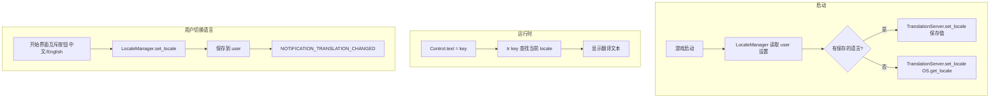

# 01 - 本地化（中英双语）

## 概述

本文档描述《旧日档案馆》**本地化功能**的设计与实现，支持中文（zh_CN）与英文（en）两种语言，通过 Godot 4 Translation 系统、CSV 翻译表、`tr()` 与 TranslationServer 完成。语言切换在游戏开始界面通过「中文」「English」互斥按钮实现。

---

## 1. 现状与目标

### 1.1 已有基础

- `project.godot` 中已有 `config/name_localized`（zh_CN: 旧日档案馆）
- 项目当前以中文为主，约 35 个 `.gd` 脚本、12+ 个 `.tscn` 场景含硬编码中文

### 1.2 设计目标

1. **零硬编码**：所有代码与场景中不再存在中文或英文硬编码，用户可见文本、错误提示、默认值一律使用 `tr("KEY")` 通过 CSV 管理
2. **语言切换**：开始界面提供「中文」「English」互斥按钮，点击即时切换并持久化
3. **覆盖范围**：主菜单、暂停菜单、TopBar、房间/区域名称、侵蚀/庇护、地图编辑器、悬停/详情面板等全部用户可见文本

---

## 2. 技术方案

### 2.1 流程

Godot 4 本地化：CSV → 导入为 `.translation` → Project Settings 注册 → `tr()` / TranslationServer

### 2.2 约定

| 项目 | 说明 |
|------|------|
| 键命名 | `CATEGORY_ITEM`（如 `MENU_NEW_GAME`、`ROOM_TYPE_LIBRARY`） |
| Locale | `en`（英文）、`zh_CN`（简体中文） |
| Fallback | `zh_CN`（项目以中文为主） |
| 持久化 | `user://settings.cfg`，键 `locale` |

---

## 3. 翻译资源

### 3.1 CSV 格式

路径：`translations/translations.csv`

```csv
keys,en,zh_CN
MENU_NEW_GAME,New Game,新游戏
MENU_CONTINUE,Continue,继续游戏
LANG_ZH,Chinese,中文
LANG_EN,English,英文
...
```

- UTF-8 无 BOM
- 含逗号、换行、双引号的字符串需用双引号包裹

### 3.2 Key 清单（按模块）

| 模块 | 示例 Key | 数量级 |
|------|----------|--------|
| 主菜单/存档 | MENU_NEW_GAME, MENU_CONTINUE, SLOT_EMPTY, SLOT_DELETE_CONFIRM, LANG_ZH, LANG_EN | ~27 |
| 暂停菜单 | PAUSE_RESUME, PAUSE_SAVE, PAUSE_LOAD | ~15 |
| TopBar/UI | LABEL_COGNITION, LABEL_RESEARCHER, BTN_CLEANUP, BTN_CONSTRUCTION | ~30 |
| 房间/区域 | ROOM_TYPE_LIBRARY, RESOURCE_COGNITION, ZONE_RESEARCH, CLEAN_STATUS_UNCLEANED | ~35 |
| 侵蚀/庇护 | SHELTER_EXTREME, SHELTER_SAFE, EROSION_LATENT, EROSION_MILD | ~20 |
| 地图编辑器 | EDITOR_FLOOR, EDITOR_ROOM, EDITOR_SAVE_MAP, EDITOR_ROOM_LIST | ~50 |
| 悬停/详情面板 | HOVER_ROOM_TYPE, HOVER_COST, HOVER_INSUFFICIENT, HOVER_NO_DESC | ~30 |
| 错误消息 | ERROR_OPEN_FILE, ERROR_SAVE_FAILED | ~10 |

**合计约 200+ 条**；占位符使用 `tr("KEY") % [a, b]`。

---

## 4. 语言管理与切换 UI

### 4.1 LocaleManager（Autoload）

- 路径：`scripts/core/locale_manager.gd`
- 职责：`set_locale(locale)` 调用 `TranslationServer.set_locale()`，读取/保存 `user://settings.cfg`
- 启动：未保存时用 `OS.get_locale_language()`，匹配 `zh`/`en` 则使用，否则 Fallback

### 4.2 开始界面互斥按钮

- 位置：`start_menu.tscn` 主界面 VBox
- 两个按钮：**中文**、**English**，对应 `LANG_ZH`、`LANG_EN`
- 使用 `ButtonGroup` 或 `ToggleButton` 实现互斥
- 点击后调用 `LocaleManager.set_locale()`，触发 `NOTIFICATION_TRANSLATION_CHANGED` 自动刷新

---

## 5. 脚本与场景改造

### 5.1 脚本改造原则

- 用户可见：`tr("KEY")` 或 `tr("KEY") % [...]`
- 错误/日志：面向用户的 `push_error`/`print` 也使用 `tr("ERROR_xxx")`
- 默认值：`"未命名"` 等改为 `tr("DEFAULT_UNTITLED")`

### 5.2 核心文件

| 文件 | 改造内容 |
|------|----------|
| room_info.gd | get_room_type_name、get_resource_type_name、get_clean_status_name |
| erosion_core.gd | get_shelter_status_name、_get_mystery_erosion_name、get_erosion_name、get_erosion_source_text |
| zone_type.gd | get_zone_name、get_category_for_zone、CATEGORY_* 常量 |
| start_menu.gd | 动态文本、tooltip、语言按钮逻辑 |
| pause_menu.gd | 动态文本、dialog |
| ui_main.gd | 因子/人员标签 |
| 其他 UI/编辑器脚本 | 所有 lbl.text、btn.text、tooltip、placeholder |

### 5.3 场景改造

- 将 `text = "中文"` 改为 `text = "MENU_NEW_GAME"` 等 key
- Godot 会自动按当前 locale 翻译 Control 的 text
- 涉及：start_menu、pause_menu、ui_main、time_panel、shelter_erosion_panel、room_detail_panel、construction_overlay、cleanup_overlay、calamity_bar、map_editor 等

---

## 6. 数据流



---

## 7. room_info 同步

`datas/room_info.json` 中的 `room_name`、`pre_clean_text`、`desc` 保持中文便于设计与编辑。当用户表示「我调整了 roominfo」时，触发本地化同步工作流：

1. **解析** `room_info.json`，遍历 `rooms` 数组
2. **对每个 room**：生成 `ROOM_XXX_NAME`、`ROOM_XXX_PRE_CLEAN`、`ROOM_XXX_DESC`（XXX 为 id 如 001）
3. **合并到** `translations.csv`：zh_CN=JSON 原文，en=AI 翻译
4. **运行时**：有 `json_room_id` 的房间用 `tr("ROOM_001_NAME")` 等；无 id 的编辑器新建房间显示原始文本

详见 `.cursor/subagents/room-info-locale-sync.md` 及 `.cursor/rules/room-info-locale-sync.mdc`。

---

## 8. 导入说明

- 将 `translations/translations.csv` 放入项目后，在 Godot 编辑器中打开项目，引擎会自动导入并生成 `translations.en.translation`、`translations.zh_CN.translation`
- 若翻译未生效，检查 Project Settings → Internationalization → Locale 中 translations 列表是否包含上述文件
- Fallback 建议设为 `zh_CN`

## 9. 参考

- 术语对照：[docs/settings/00-project-keywords.md](../../settings/00-project-keywords.md)
- Godot 文档：Internationalization、TranslationServer、Importing translations
- 项目概览：[00-project-overview.md](../00-project-overview.md)
